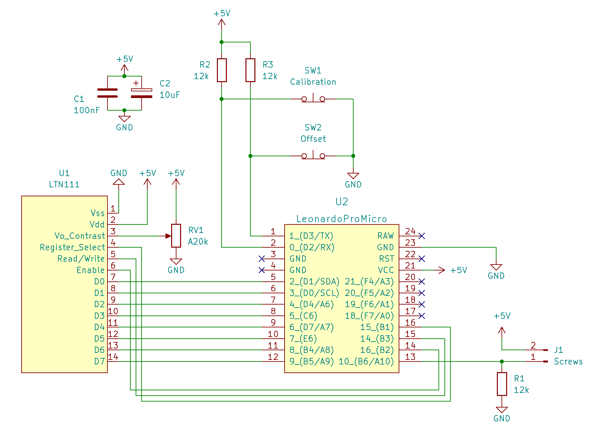

# Rapid Ohmmeter

Measuring a single resistor with your digital multimeter or one of these (super useful) modern multifunction testers felt way too slow and cumbersome to me. So I thought about how to build a really fast tool to measure resistors flying around my workbench. Here is what I came up with.

# Circuit diagram

I found a really old LCD display in my material storage an I also had a couple of cheap Arduino Leonardo "Pro Micro" clones flying around on my workbench. So I puzzeled some components together, being inspired by this project: https://www.circuitbasics.com/arduino-ohm-meter/

It also turned out that the right half of the LCD obviously was damaged but the left half is sufficient anyways.

Here is the schematic I finally used:

I used two large screws as contacts so it is easy to touch resistors with them.

Controls:

Offset Button: short-circuit the two contacts so that there is a resistance of 0 ohms and press the Offset Button to calibrate the lower end of the scale.

Calibration Button: hold a 10k resistor to the screws and press the Calibration Button to improve scaling.

The potentiometer can be used to adjust the contrast of the LCD display.
