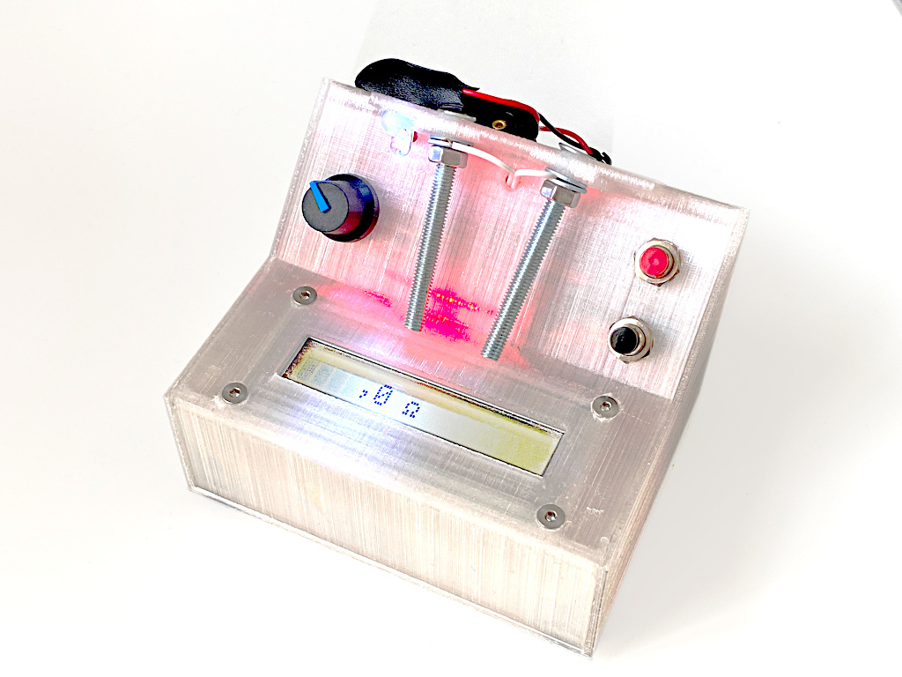
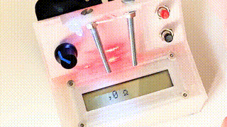

# Rapid Ohmmeter

Measuring a single resistor with a digital multimeter or one of these (super useful) modern multifunction testers is way too slow and cumbersome for me. So I thought about how to build a really fast tool to measure resistors flying around on my workbench. Here is what I came up with.

(The case was made out of semi-transparent PLA which explains the coloring.)

I found a really old LCD display in my inventory an I also had a couple of cheap Arduino Leonardo "Pro Micro" clones flying around on my workbench. So I puzzled some components together, being inspired by this project: https://www.circuitbasics.com/arduino-ohm-meter/ For the contacts I used two large screws to make it easy to press the resistors against them. Now measuring a resistor is possible in the wink of an eye.

It also turned out that the right half of the LCD obviously was damaged but the left half is sufficient anyways.

# Circuit diagram

Here is the schematic I finally used:

Controls:

Offset Button: short-circuit the two contacts so that there is a resistance of 0 ohms and press the Offset Button to calibrate the lower end of the scale.

Calibration Button: hold a 10k resistor to the screws and press the Calibration Button to improve scaling.

The potentiometer can be used to adjust the contrast of the LCD display.
